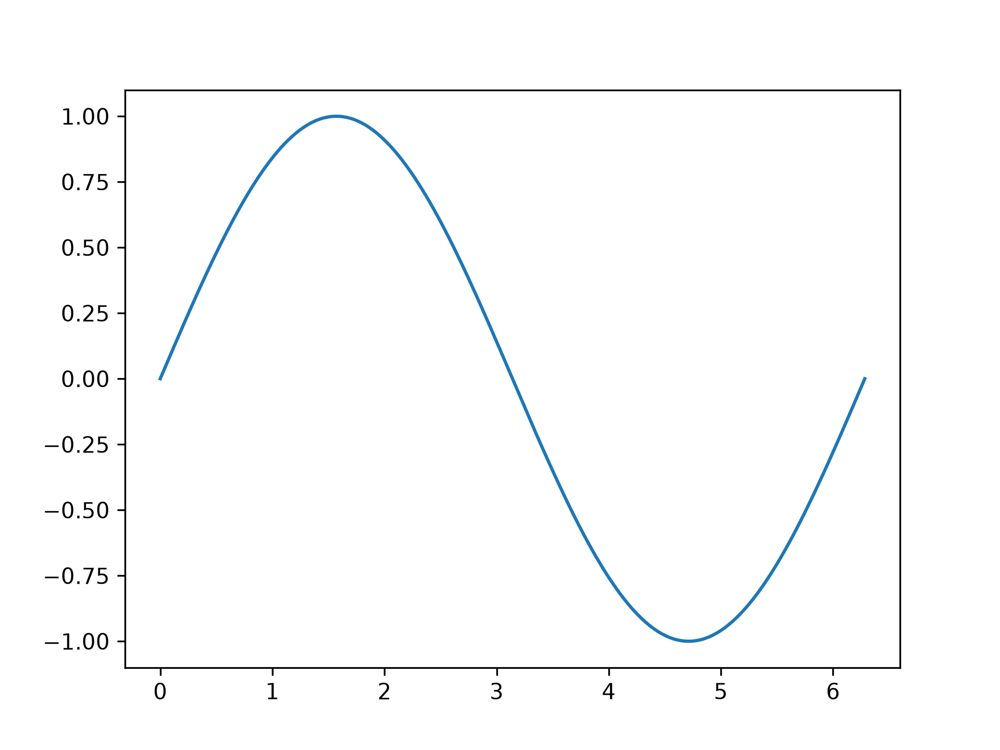

#+title: {{Title}}
#+author: {{Author}}
#+options: toc:nil
#+latex_header: \usepackage{caption}
#+latex_header: \captionsetup{labelsep=period}
#+latex_header: \captionsetup[table]{skip=6pt}

#+begin_abstract
This is the abstract of the document. It briefly summarizes the purpose, method, and main result.
#+end_abstract

* Introduction

This is an Org mode academic template. Multiple choices are already made assuming you will be using a bibliography, tables, inline math and math blocks.

* Customize

** Language

When using another language, you can set additional \LaTeX headers such as:

#+begin_src org
#+latex_header: \usepackage[spanish,es-tabla]{babel}
#+latex_header: \AtBeginDocument{\selectlanguage{spanish}}
#+end_src

You also probably want to indicate the spelling engine which dictionary to use in a top comment

#+begin_src org
# -*- ispell-local-dictionary: "es"; -*-
#+end_src

** Table of Contents

By default, the table of contents is disabled but can be re-enabled by omitting:

#+begin_src org
#+options: toc:nil
#+end_src

** Layout

This template does not apply any layout changes, but these are some commonly applied ones:

#+begin_src org
#+latex_class: article
#+latex_class_options: [12pt,letterpaper]
#+latex_header: \usepackage[margin=1in]{geometry}
#+latex_header: \usepackage{setspace}
#+latex_header: \onehalfspacing
#+latex_header: \usepackage{multicol}
#+end_src

** Bibliography

 By default, this will use the bibliography file located at ~~/Documents/bibliography.bib~, but this behavior can be overwritten:

#+begin_src org
#+bibliography: ~/Documents/bibliography.bib
#+end_src

The bibliography style can also be changed, it looks for ~.csl~ files in ~~/.config/zotero/styles~, but a full path to a CSL file can also be specified.

#+begin_src org
#+cite_export: csl ieee.csl
#+end_src

This is an example citation. [cite:@joukowsky1900uber]

* Content

** Equations

Even though inline math like \(E=mc^2\) is cool, there are other ways to print equations.

The following is an example of an unnumbered equation.

\[
e^{i\pi} = -1
\]

The following is an example of a numbered equation.

#+name: eq:boltzmann
\begin{equation}
S = k \log W
\end{equation}

Reference equations like Equation [[eq:boltzmann]].

The preferred way to insert quantities is with ~siunitx~'s ~qty~ macro, and other mathematical symbols with ~amsmath~. To do this import:

#+begin_src org
#+latex_header: \usepackage{amsmath}
#+latex_header: \usepackage{siunitx}
#+end_src

** Tables

#+caption: Example data
#+name: tab:people
| Name | Age |
|------+-----|
| John |  30 |
| Jane |  30 |

Reference tables like Table [[tab:people]].

** Figures

Sometimes you want figures to be auto-generated. Python is useful for this task, in order to use a virtual environment's ~python~ executable, set (either as global property or per code block):

#+begin_src org
#+property: header-args:python :python ~/.local/share/venvs/science/bin/python
#+end_src

#+begin_quote
*Note:* ~:exports none~ hides the code from the output, omit this to also include the code.
#+end_quote

#+begin_src python :results silent :exports none
import matplotlib.pyplot as plt
import numpy as np

x = np.linspace(0, 2*np.pi, 200)
y = np.sin(x)
plt.plot(x,y)
plt.savefig("example_plot.png", dpi=300)
#+end_src

#+caption: Plot \(y = \sin x\).
#+name: fig:sine

Reference figures like Figure [[fig:sine]].

#+print_bibliography:
